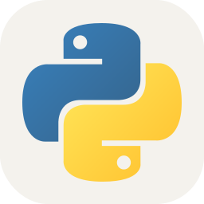
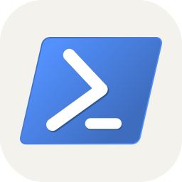
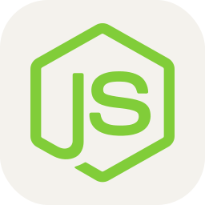

<!--
    Hey there, I'm Christian Darby-Ward!
    Happy to see you here exploring my README code
    Feel free to inspire!
    
    But may I please ask you to follow me in return? Just a click!
    You may also want to connect with me on LinkedIn @christian-darby-ward
-->
 
<picture>
  <source media="(prefers-color-scheme: dark)" srcset="./assets/typing-dark.svg"/>
  <source media="(prefers-color-scheme: light)" srcset="./assets/typing-light.svg"/>
  
</picture>
<!--
     This is the list of my skills and tools I am studying!
-->

## About Me

- Windows software developer shipping production tools in C#/.NET, WPF, JavaScript, and PowerShell.
- Building [CTBL++](https://github.com/Detractless/CTBLplusplus), a community-built open-source Windows add-on for intentional, low-distraction computing.
- Designing personal productivity tools and minimalist desktop environments.
- Student at Kennesaw State University studying software development, criminal justice, and psychology.
- Chess, greasing the groove, and minimalist enthusiast.

### Skill Set

<table><tr><td valign="top" width="33%">

### Frontend  

  
    <a href="https://developer.mozilla.org/en-US/docs/Web/HTML"><picture><source media="(prefers-color-scheme: dark)" srcset="./assets/icons/HTML.svg"/><source media="(prefers-color-scheme: light)" srcset="./assets/icons/HTML.svg"/></picture></a>&nbsp;
    <a href="https://developer.mozilla.org/en-US/docs/Web/CSS"><picture><source media="(prefers-color-scheme: dark)" srcset="./assets/icons/CSS.svg"/><source media="(prefers-color-scheme: light)" srcset="./assets/icons/CSS.svg"/></picture></a>&nbsp;
    <a href="https://developer.mozilla.org/en-US/docs/Web/JavaScript"><picture><source media="(prefers-color-scheme: dark)" srcset="./assets/icons/JavaScript.svg"/><source media="(prefers-color-scheme: light)" srcset="./assets/icons/JavaScript.svg"/></picture></a>

</td><td valign="top" width="33%">
        
### Languages

    <a href="https://learn.microsoft.com/en-us/dotnet/csharp/"><picture><source media="(prefers-color-scheme: dark)" srcset="./assets/icons/CS.svg"/><source media="(prefers-color-scheme: light)" srcset="./assets/icons/CS.svg"/></picture></a>&nbsp;
    <a href="https://dotnet.microsoft.com/"><picture><source media="(prefers-color-scheme: dark)" srcset="./assets/icons/DotNet.svg"/><source media="(prefers-color-scheme: light)" srcset="./assets/icons/DotNet.svg"/></picture></a>&nbsp;
    <a href="https://www.python.org/"><picture><source media="(prefers-color-scheme: dark)" srcset="./assets/icons/Python-Dark.svg"/><source media="(prefers-color-scheme: light)" srcset="./assets/icons/Python-Light.svg"/></picture></a>&nbsp;
    <a href="https://learn.microsoft.com/en-us/powershell/"><picture><source media="(prefers-color-scheme: dark)" srcset="./assets/icons/Powershell-Dark.svg"/><source media="(prefers-color-scheme: light)" srcset="./assets/icons/Powershell-Light.svg"/></picture></a>

</td><td valign="top" width="33%">
  
### Tools

    <a href="https://git-scm.com/"><picture><source media="(prefers-color-scheme: dark)" srcset="./assets/icons/Git.svg"/><source media="(prefers-color-scheme: light)" srcset="./assets/icons/Git.svg"/></picture></a>&nbsp;
    <a href="https://github.com/"><picture><source media="(prefers-color-scheme: dark)" srcset="./assets/icons/Github-Dark.svg"/><source media="(prefers-color-scheme: light)" srcset="./assets/icons/Github-Light.svg"/></picture></a>&nbsp;
    <a href="https://nodejs.org/"><picture><source media="(prefers-color-scheme: dark)" srcset="./assets/icons/NodeJS-Dark.svg"/><source media="(prefers-color-scheme: light)" srcset="./assets/icons/NodeJS-Light.svg"/></picture></a>&nbsp;
    <a href="https://code.visualstudio.com/"><picture><source media="(prefers-color-scheme: dark)" srcset="./assets/icons/VSCode-Dark.svg"/><source media="(prefers-color-scheme: light)" srcset="./assets/icons/VSCode-Light.svg"/></picture></a>

</td></tr></table>

### Featured Projects

**[CTBL++](https://github.com/Detractless/CTBLplusplus)** — Cold Turkey Blocker Plus Plus, a community-built open-source Windows add-on featuring a C#/.NET Engine, dual watchdogs, WPF/WebView2 UI, and tamper-resistant queued delay mechanics. Designed to help users build intentional, low-distraction computing environments.

### Connect with me!

<!--
     Oh, hello there, recruiters!
-->

### Employer?

> [!IMPORTANT]  
> <a href="https://docs.google.com/document/d/1QXdqY5nCZONamhFpsfpsnDDMZlCxpNB-/export?format=pdf">Download my resume</a>

> Open to internships, freelance/gig work, and entry-level opportunities in software development, or criminal justice.

<!--
     Thanks for being my guest ♥
-->
